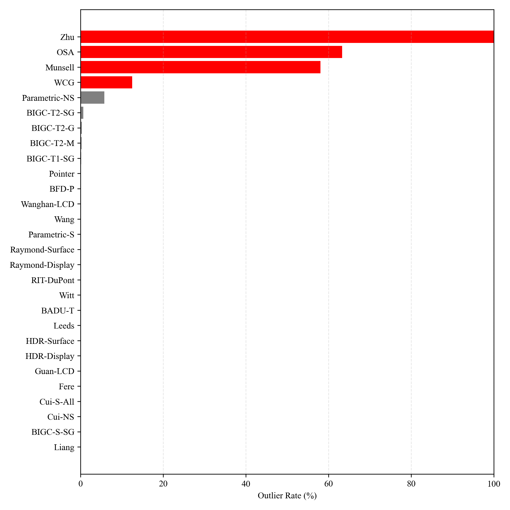

# Introduction

## Objective

The present study aims to validate the Meta-Color data infrastructure by evaluating the performance of the CIEDE2000 colour-difference formula across 32 experimental datasets spanning a wide range of colour-difference magnitudes and viewing conditions.

## Methodology

### Scaling Factor Computation

For each dataset, a **Scaling Factor** ($F$) was computed to minimize the least-squares error between the computed colour difference ($\Delta E_{00}$) and the visual colour difference ($\Delta V$). The scaling factor was determined using Equation (1):

$$F = \frac{\sum_{i=1}^{N} \Delta E_{00,i} \cdot \Delta V_i}{\sum_{i=1}^{N} \Delta E_{00,i}^2}$$ {#eq:scaling}

This formulation ensures that the scaled predicted colour differences are brought onto the same scale as the visual assessments.

### Performance Metric

The **Scaled Ratio** is defined as:

$$R_i = \frac{\Delta E_{00,i}}{F \cdot \Delta V_i}$$ {#eq:ratio}

Under ideal conditions, $R_i = 1.0$ for all sample pairs.

# Performance Consistency Across Magnitudes

## Global Statistics

The analysis encompassed **18,137 colour-difference pairs** across 32 datasets:

| Statistic | Value |
|-----------|-------|
| Global Mean Ratio | 0.9828 |
| Global Std Dev | 0.6664 |
| ±1σ Range | [0.3164, 1.6491] |
| Outlier Rate | 1.67% |

: Global performance statistics {#tbl:global-stats}

## Magnitude Dependency Analysis

Figure @fig:ratio-trend presents the Scaled Ratio plotted against computed colour difference, showing **no systematic magnitude dependency**.

{#fig:ratio-trend width=85%}

### Interpretation

The scatter plot reveals:

1. **Absence of Systematic Bias**: No tilting trend across magnitude range
2. **Homoscedasticity**: Constant vertical spread indicates uniform prediction error
3. **±1σ Coverage**: Bands encompass majority of data points

# Dataset Heterogeneity

## Outlier Ranking

Figure @fig:outlier-ranking identifies datasets with anomalous behavior.

{#fig:outlier-ranking width=85%}

## High-Noise Datasets

The top three datasets with highest outlier rates:

Dataset           Outlier Rate   Hypothesized Cause
----------------- -------------- -----------------------------------
WCG               25.0%          Extreme chromaticity, high saturation
Parametric-NS     10.2%          Simultaneous contrast (no separation)
BIGC-T2-SG        5.1%           Gloss-related effects

: High-noise datasets and potential causes {#tbl:outliers}

# Conclusion

## Summary

The audit successfully harmonized 32 datasets using dataset-specific scaling factors, yielding:

- **Scaling Factor Robustness**: Global mean ratio of 0.9828
- **Magnitude Independence**: No systematic dependency observed
- **Data Integrity Confirmed**: Outliers reflect genuine CIEDE2000 limitations

## Recommendations

1. Implement inverse-variance weighting for Module 2
2. Investigate parametric effects (separation, gloss, gamut)
3. Benchmark CAM16-UCS against high-noise datasets

# References

::: {#refs}
:::
